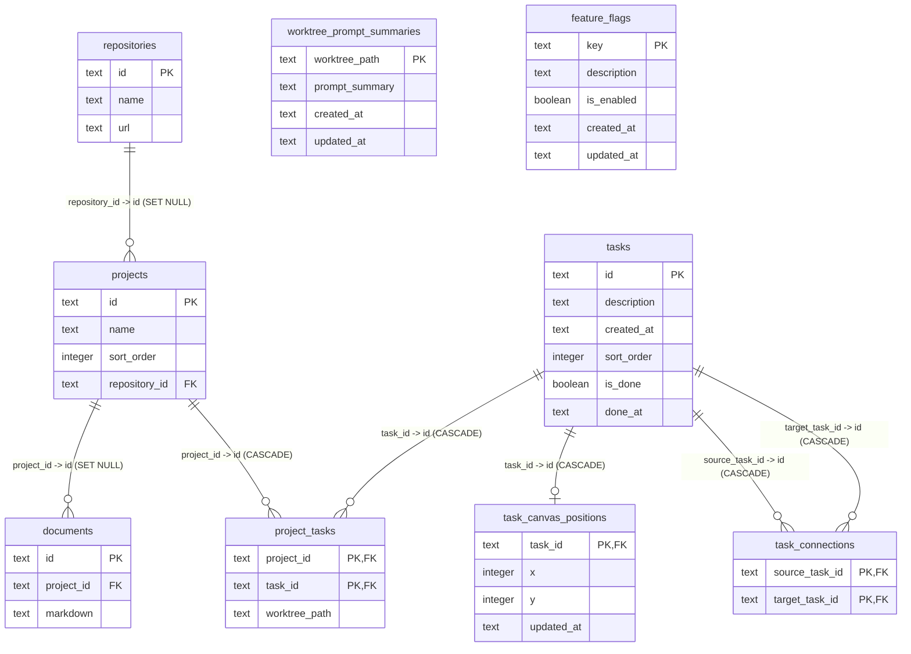

# Local DB Data Model

This document describes the data models defined in `schema.ts` and how they relate.

## Mermaid Diagram

## Notes

- `worktree_prompt_summaries` and `feature_flags` are standalone tables with no foreign-key connections in the current schema.
- Foreign keys from `projects` and `documents` use `ON DELETE SET NULL`.
- `project_tasks` is the join table between `projects` and `tasks`, and both foreign keys use `ON DELETE CASCADE`.
- `project_tasks.task_id` is unique, so a task can be assigned to at most one project.
- `project_tasks.worktree_path` stores the task execution worktree path when an assigned task is executed.
- `task_canvas_positions` stores persisted x/y coordinates for each task's infinite canvas card.
- `task_canvas_positions.task_id` is both PK and FK, so each task has at most one persisted position row.
- `task_connections` stores normalized task-to-task links (`source_task_id`, `target_task_id`) with `ON DELETE CASCADE` on both sides.
- Each task connection pair is unique by composite primary key, and the app writes rows in canonical order to prevent mirrored duplicates.
- `projects.sort_order` stores the manual ordering shown in the Projects list.
- `tasks.sort_order` stores the manual ordering shown in task list views and project task lists.
