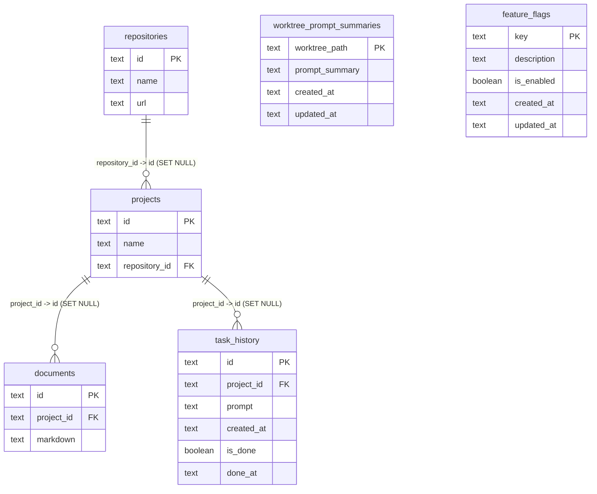

# Local DB Data Model

This document describes the data models defined in `schema.ts` and how they relate.

## Mermaid Diagram

## Notes

- `worktree_prompt_summaries` and `feature_flags` are standalone tables with no foreign-key connections in the current schema.
- Foreign keys from `projects`, `documents`, and `task_history` use `ON DELETE SET NULL`.
