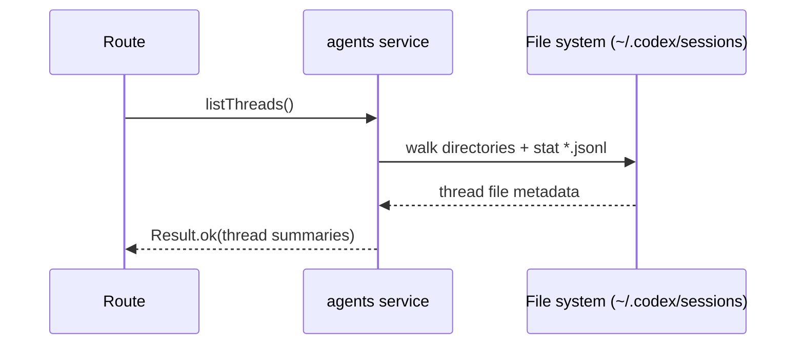
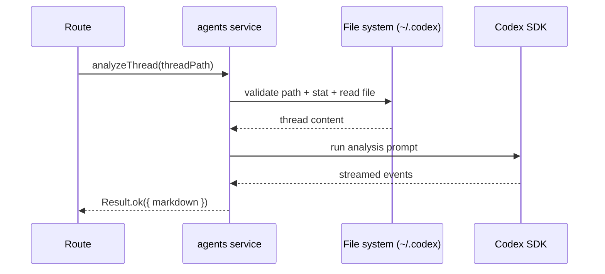

# agents domain

## Purpose
Owns coding agent integrations:
- Analyze local Codex thread logs from `~/.codex/sessions`.
- Stream execution runs through Codex or OpenCode.

## Dependencies with other domains
- `git/service` (activity tracking).

## Exposed service functions

### `createAgentsService().listThreads()`

### `createAgentsService().analyzeThread(input)`

### `streamAgentRun(input)`
Chooses the runtime provider based on `NODE_ENV`:
- `development`: OpenCode (`opencode.ts`)
- otherwise: Codex (`codex.ts`)
