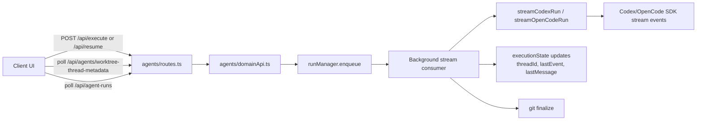
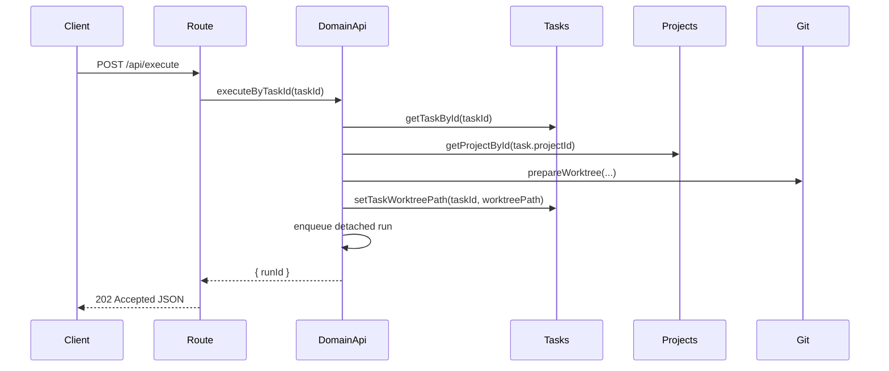
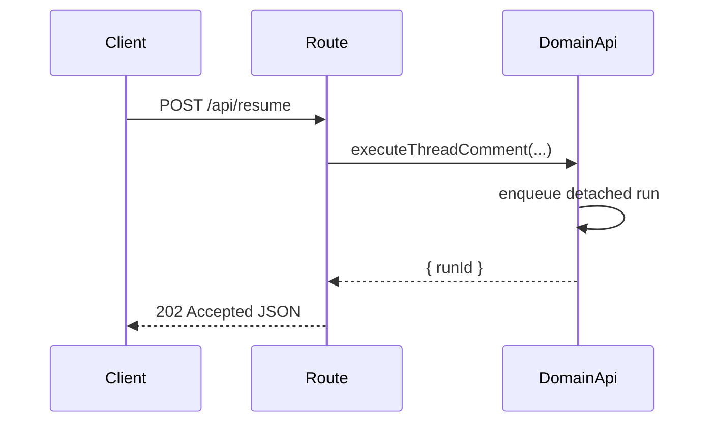
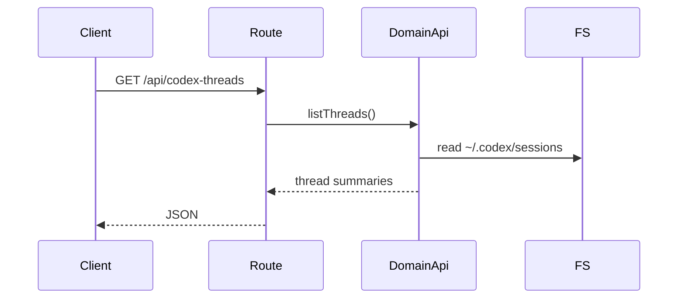
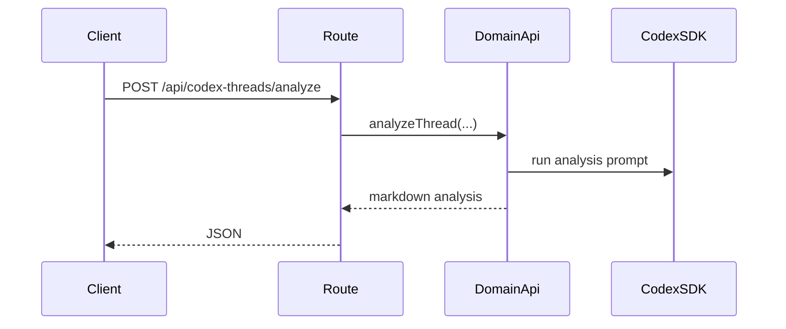
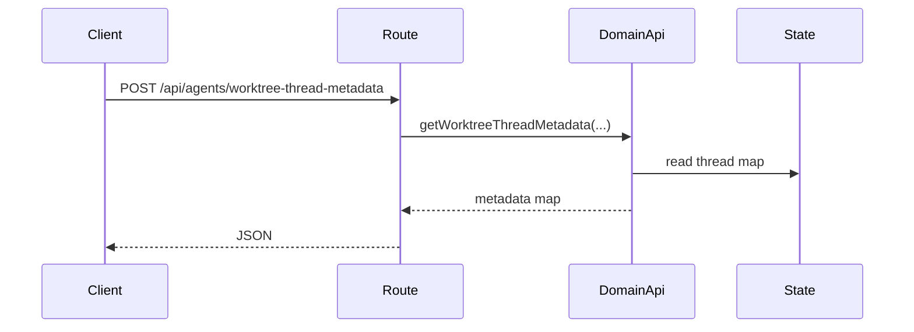
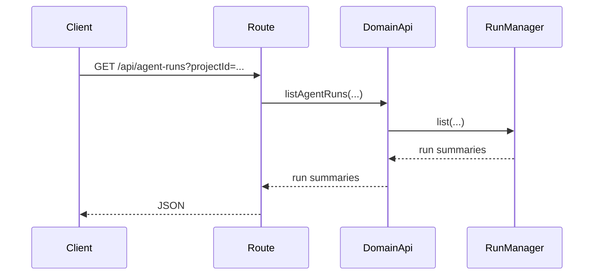

# agents domain

## Purpose
Owns coding agent integrations.

## Detached Run Architecture

## Exported service functions
- None. This domain does not currently expose `service.ts`.

## HTTP APIs (routes)

### `POST /api/execute`

### `POST /api/resume`

### `GET /api/codex-threads`

### `POST /api/codex-threads/analyze`

### `POST /api/agents/worktree-thread-metadata`

### `GET /api/agent-runs`

