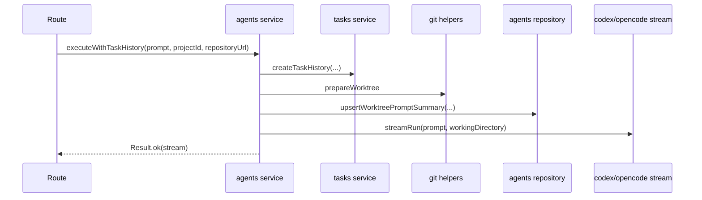
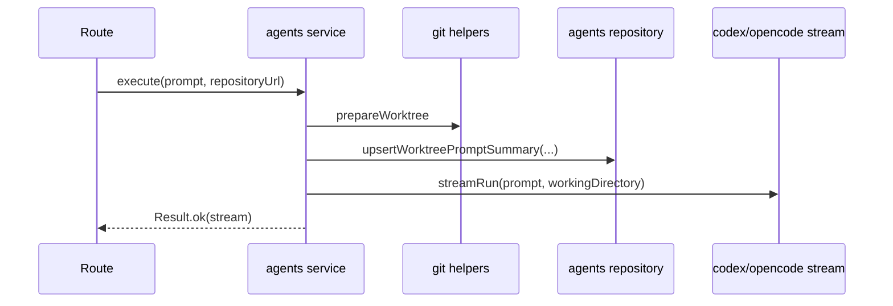
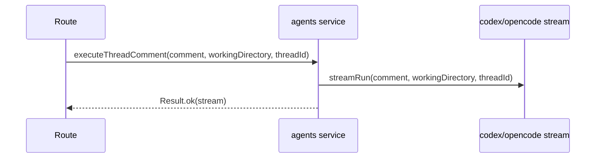
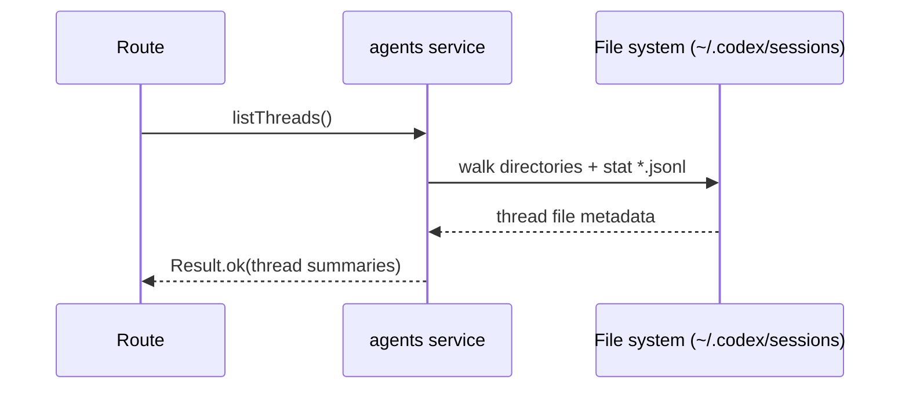
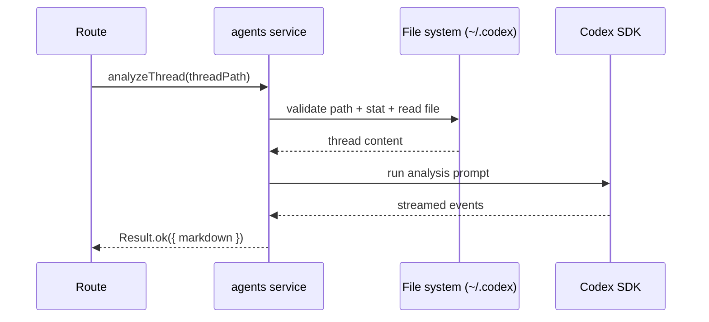

# agents domain

## Purpose
Owns coding agent integrations:
- Analyze local Codex thread logs from `~/.codex/sessions`.
- Stream execution runs through Codex or OpenCode.
- Execute prompt-driven tasks in prepared worktrees and stream results.

## Dependencies with other domains
- `git/service` (worktree preparation).
- `tasks/service` (task-history creation for `/api/execute`).

## Exposed service functions

### `createAgentsService({ clonesDir }).executeWithTaskHistory(input)`

### `createAgentsService({ clonesDir }).execute(input)`

### `createAgentsService({ clonesDir }).executeThreadComment(input)`

### `createAgentsService({ clonesDir }).listThreads()`

### `createAgentsService({ clonesDir }).analyzeThread(input)`

### `streamAgentRun(input)`
Chooses the runtime provider based on `NODE_ENV`:
- `development`: OpenCode (`opencode.ts`)
- otherwise: Codex (`codex.ts`)
