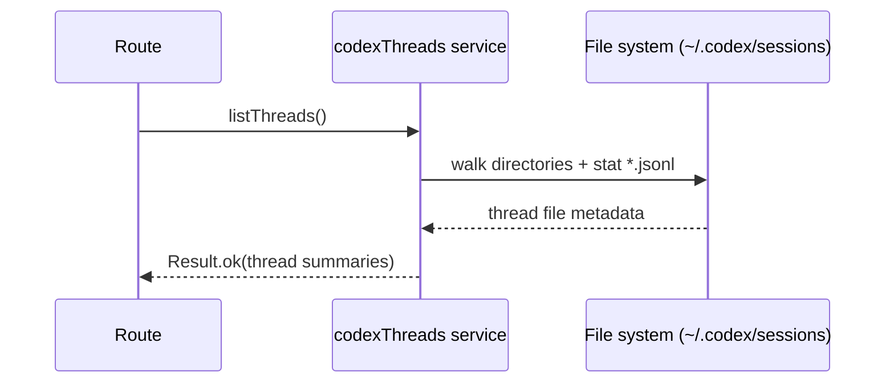
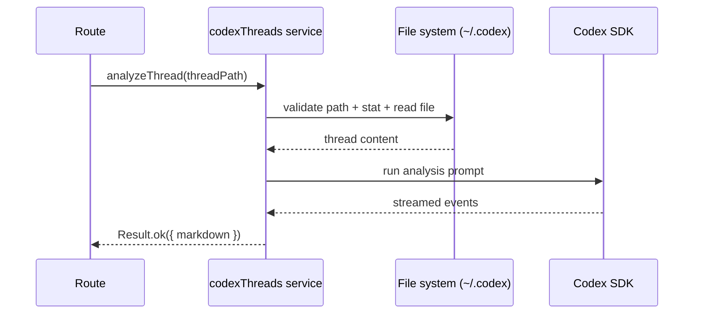

# codexThreads domain

## Purpose
Analyze local Codex thread logs from `~/.codex/sessions`.

## Dependencies with other domains
- None.

## Exposed service functions

### `createCodexThreadsService().listThreads()`

### `createCodexThreadsService().analyzeThread(input)`

