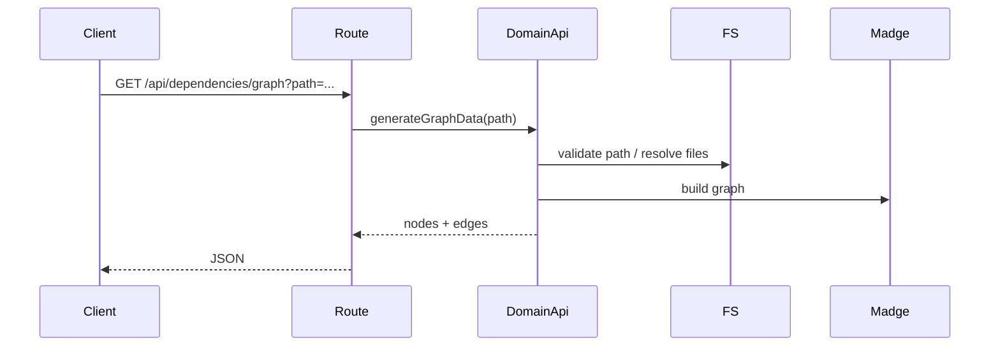

# dependencies domain

## Purpose
Generates dependency graph data for a target path.

## Exported service functions
- None. This domain does not currently expose `service.ts`.

## HTTP APIs (routes)

### `GET /api/dependencies/graph`

