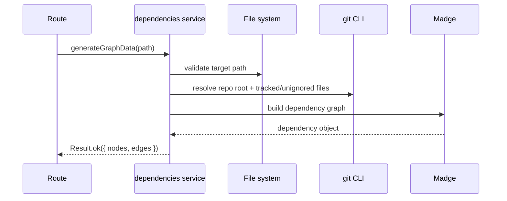

# dependencies domain

## Purpose
Generate an import graph for a target path using Madge, with git-aware input filtering when possible.

## Dependencies with other domains
- None.

## Exposed service functions

### `createDependencyService().generateGraphData(rawTargetPath)`

