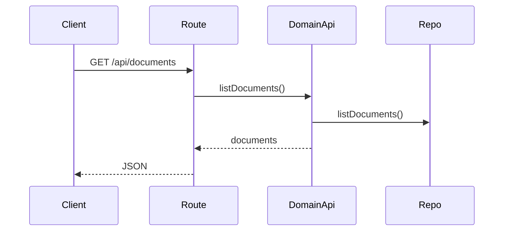
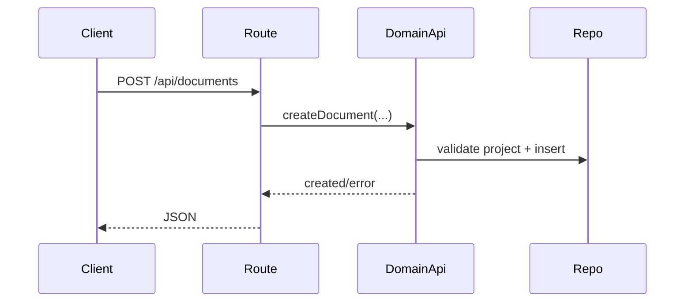
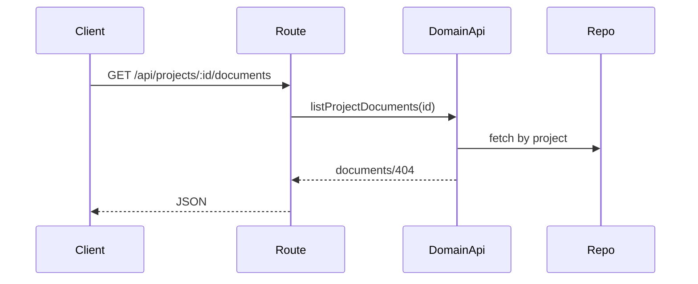
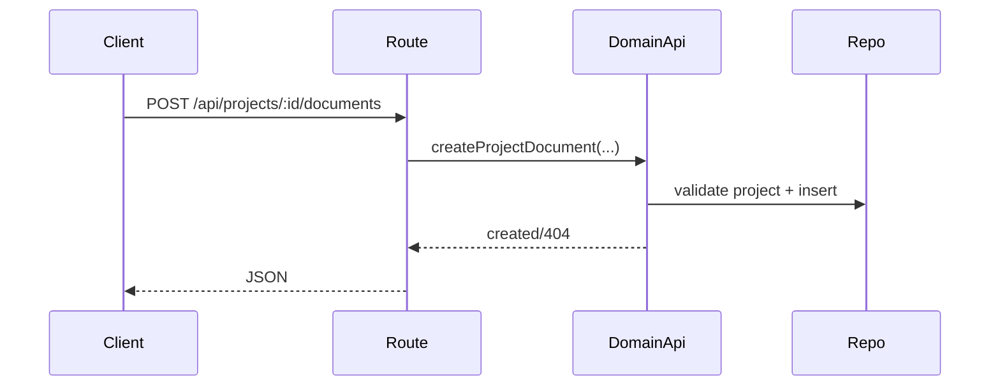
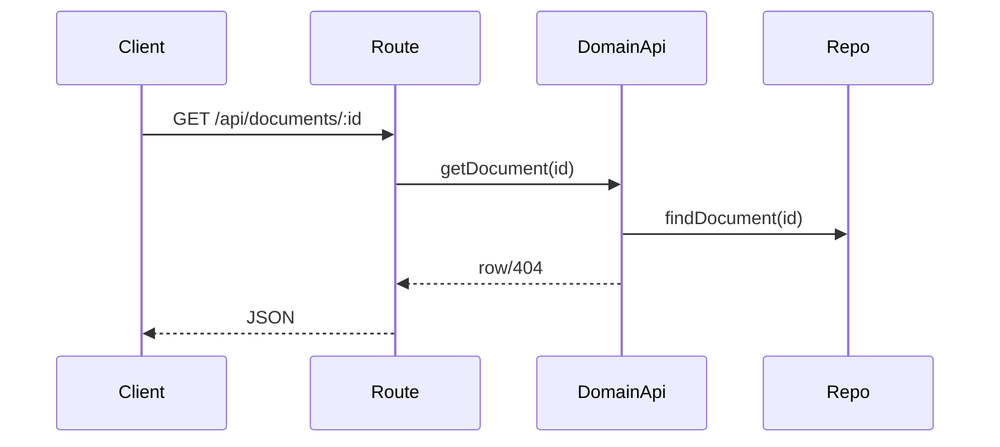
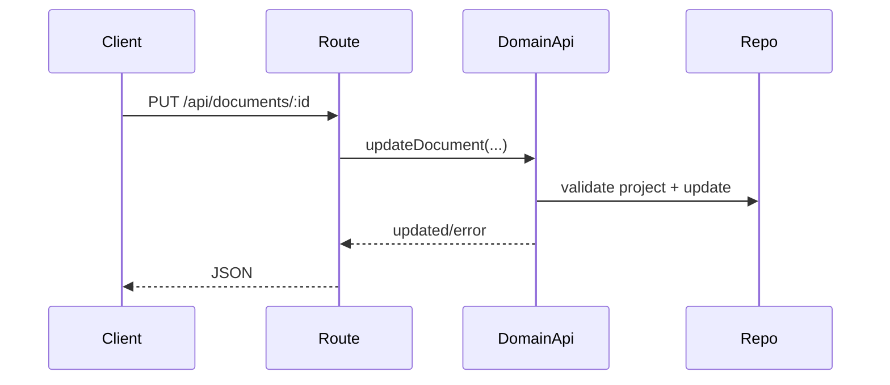
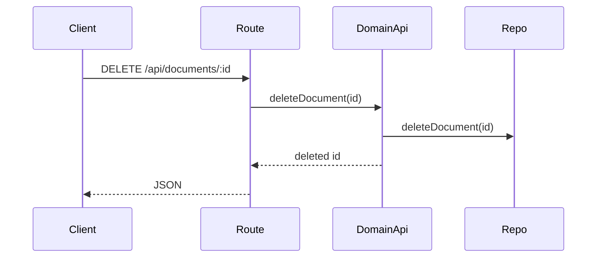

# documents domain

## Purpose
Manages markdown documents linked to projects.

## Exported service functions
- None. This domain does not currently expose `service.ts`.

## HTTP APIs (routes)

### `GET /api/documents`

### `POST /api/documents`

### `GET /api/projects/:id/documents`

### `POST /api/projects/:id/documents`

### `GET /api/documents/:id`

### `PUT /api/documents/:id`

### `DELETE /api/documents/:id`

