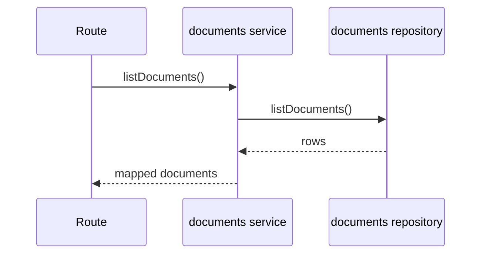
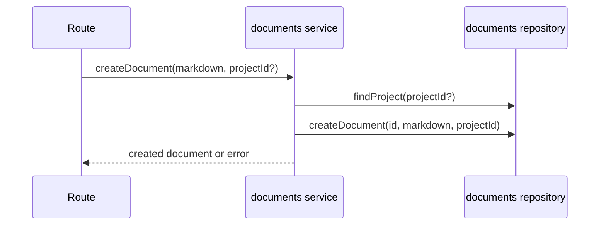
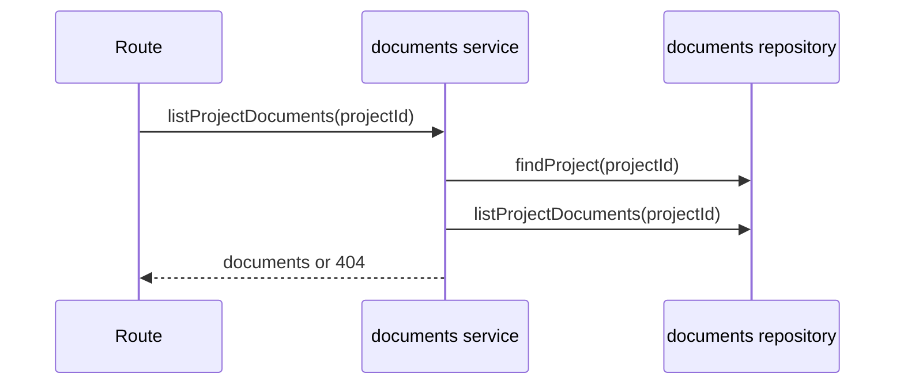
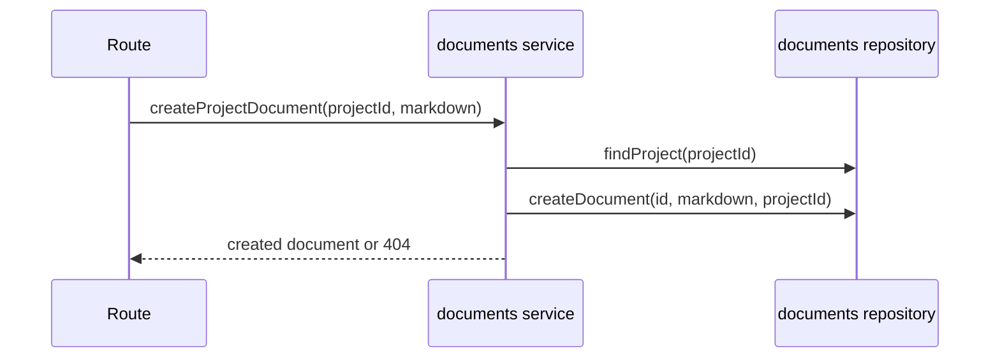
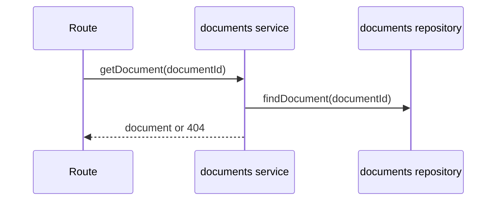
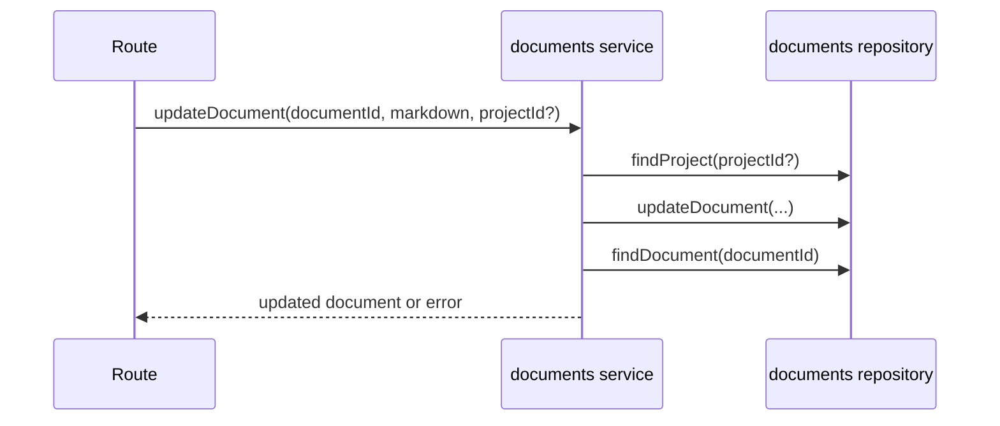
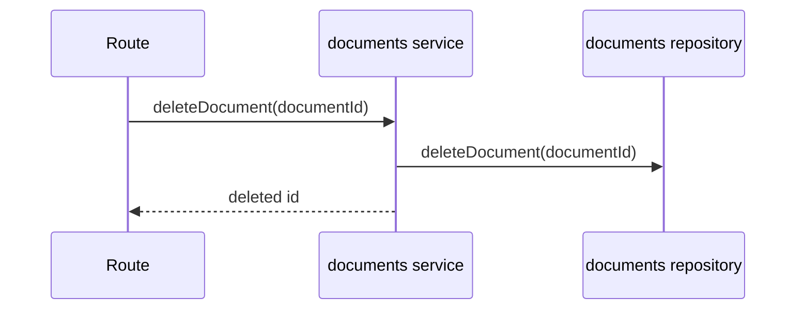

# documents domain

## Purpose
Manage markdown documents, optionally linked to a project.

## Dependencies with other domains
- None (project validation is done through this domain's repository layer).

## Exposed service functions

### `documentsService.listDocuments()`

### `documentsService.createDocument(input)`

### `documentsService.listProjectDocuments(projectId)`

### `documentsService.createProjectDocument(input)`

### `documentsService.getDocument(documentId)`

### `documentsService.updateDocument(input)`

### `documentsService.deleteDocument(documentId)`

