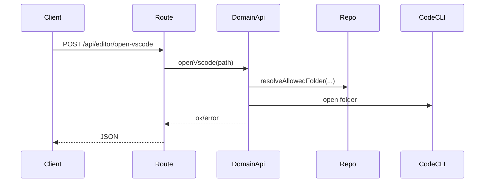

# editor domain

## Purpose
Opens an allowed local folder in VSCode.

## Exported service functions
- None. This domain does not currently expose `service.ts`.

## HTTP APIs (routes)

### `POST /api/editor/open-vscode`

