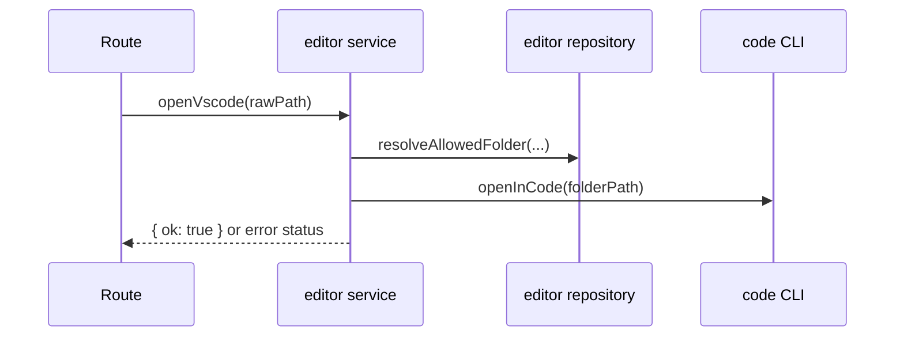

# editor domain

## Purpose
Open an allowed local folder in VSCode.

## Dependencies with other domains
- None.

## Exposed service functions

### `createEditorService({ clonesDir }).openVscode(rawPath)`

