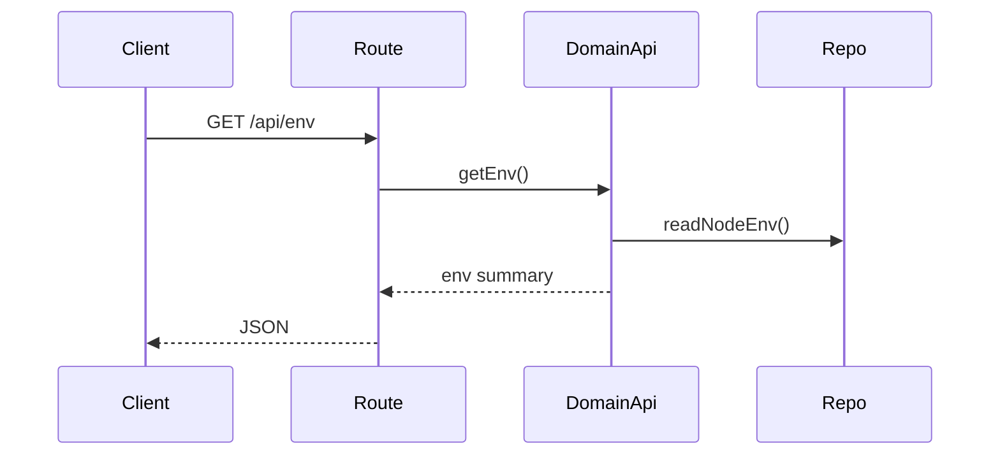

# env domain

## Purpose
Exposes server environment summary values for clients.

## Exported service functions
- None. This domain does not currently expose `service.ts`.

## HTTP APIs (routes)

### `GET /api/env`

