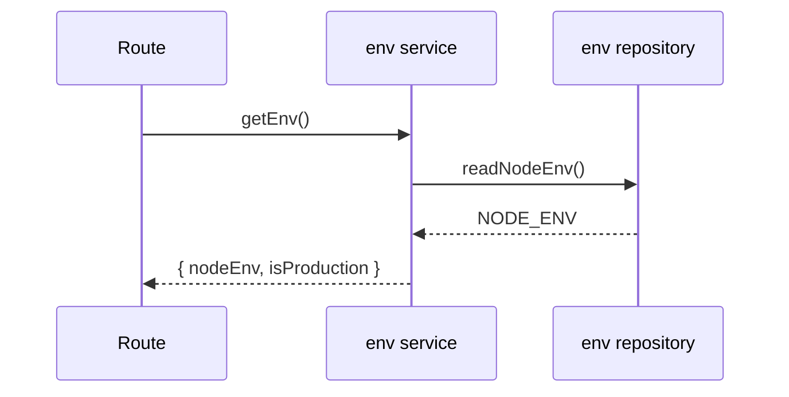

# env domain

## Purpose
Expose server environment summary values for clients.

## Dependencies with other domains
- None.

## Exposed service functions

### `createEnvService().getEnv()`

```mermaid
sequenceDiagram
    participant Route
    participant Service as env service
    participant Repo as env repository
    Route->>Service: getEnv()
    Service->>Repo: readNodeEnv()
    Repo-->>Service: NODE_ENV
    Service-->>Route: { nodeEnv, isProduction }
```
