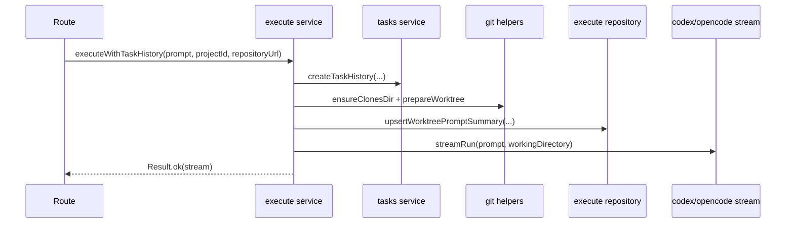
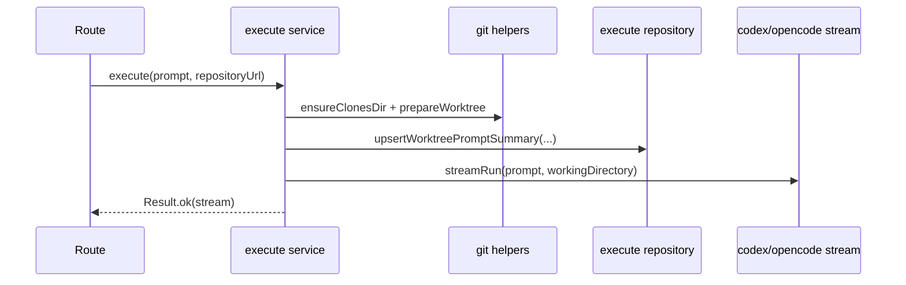
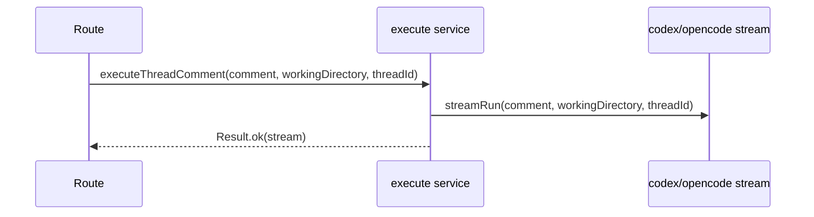

# execute domain

## Purpose
Run prompt-driven coding executions in a prepared worktree and stream results.

## Dependencies with other domains
- `tasks` domain via `tasksService.createTaskHistory` (only for `executeWithTaskHistory`).

## Exposed service functions

### `createExecuteService({ clonesDir }).executeWithTaskHistory(input)`

### `createExecuteService({ clonesDir }).execute(input)`

### `createExecuteService({ clonesDir }).executeThreadComment(input)`

