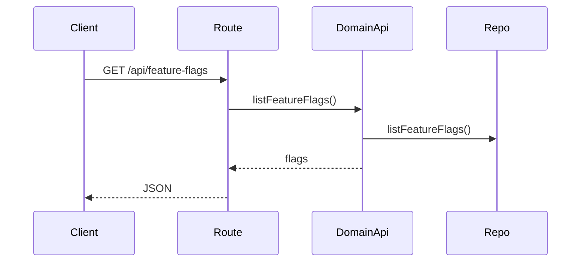
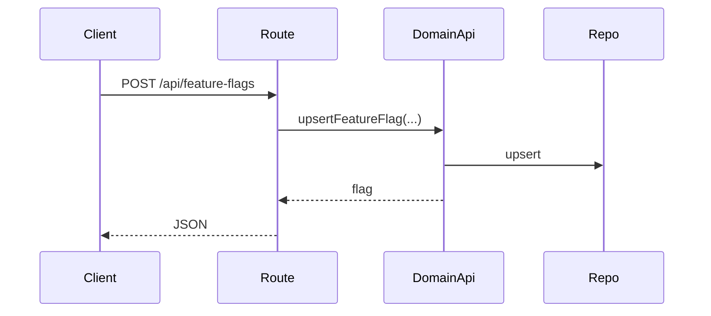
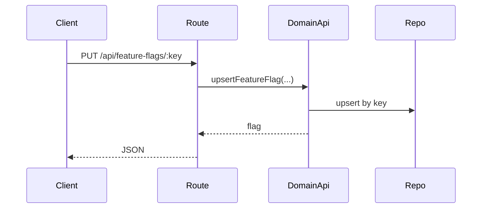
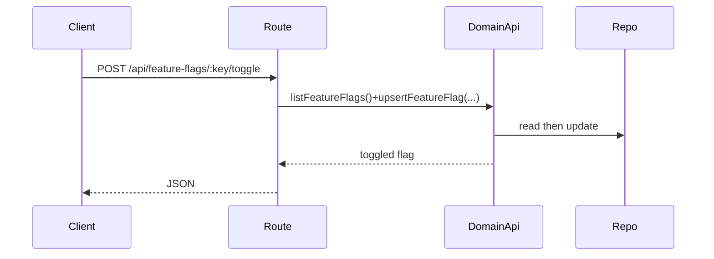

# featureFlags domain

## Purpose
Lists and updates runtime feature flags.

## Exported service functions
- None. This domain does not currently expose `service.ts`.

## HTTP APIs (routes)

### `GET /api/feature-flags`

### `POST /api/feature-flags`

### `PUT /api/feature-flags/:key`

### `POST /api/feature-flags/:key/toggle`

