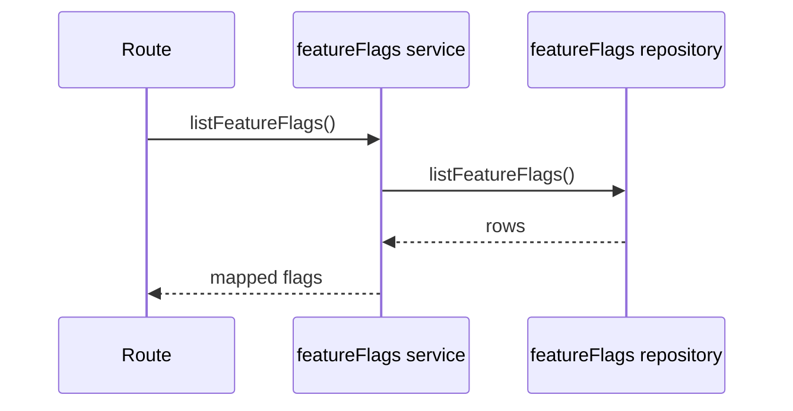
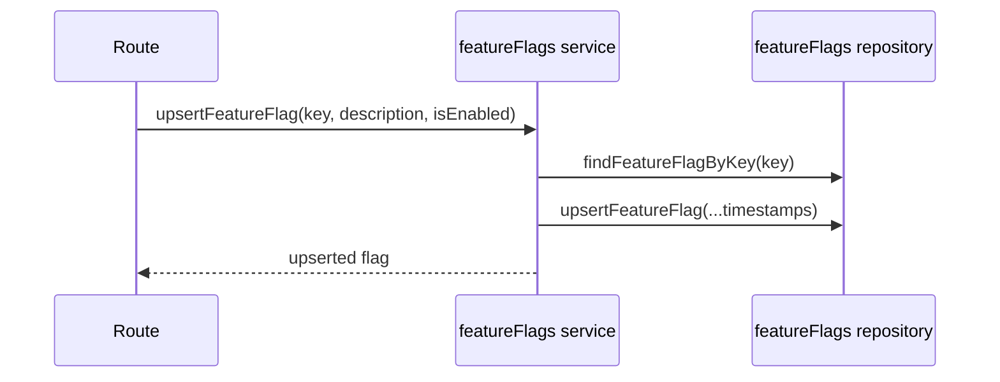

# featureFlags domain

## Purpose
List and upsert runtime feature flags.

## Dependencies with other domains
- None.

## Exposed service functions

### `featureFlagsService.listFeatureFlags()`

### `featureFlagsService.upsertFeatureFlag(input)`

