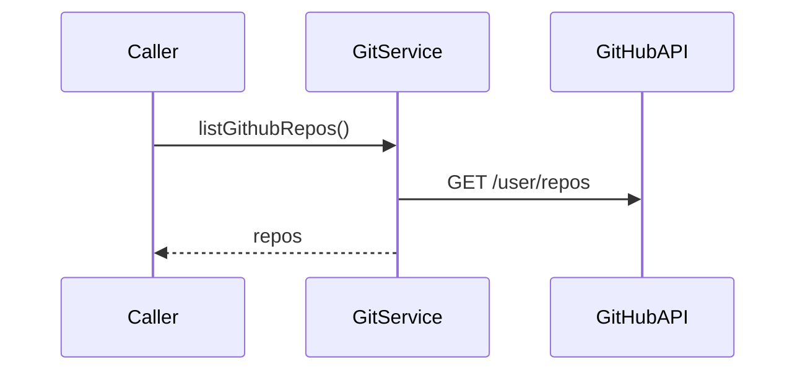
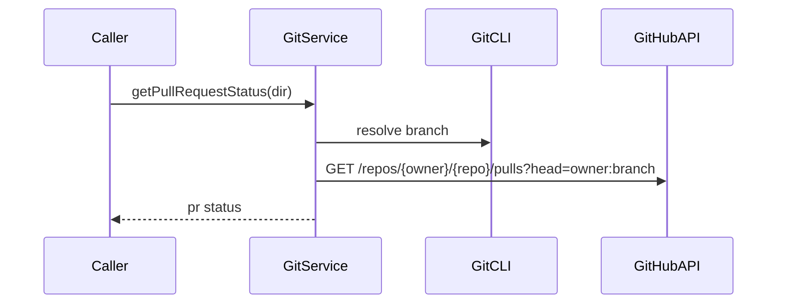
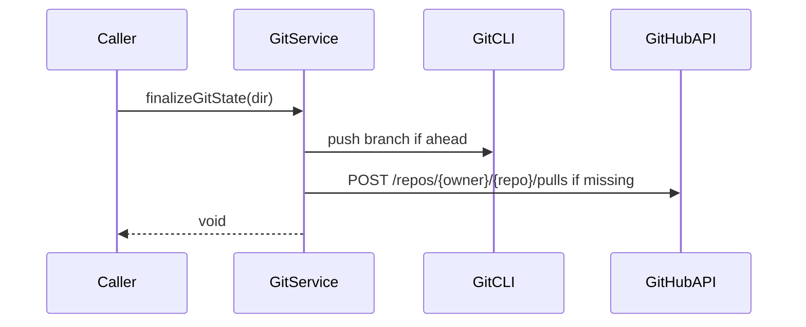
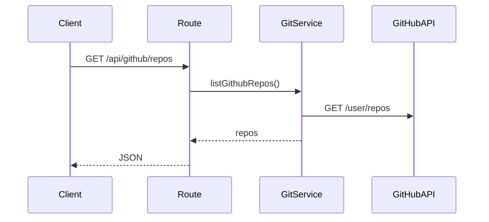

# git domain

## Purpose
Provides git and GitHub API operations for worktree lifecycle and dev terminal flows.

The pull-request cleanup worker also coordinates with the tasks domain: when a worktree is removed, any task linked through `project_tasks.worktree_path` is marked done. Cleanup skips worktrees younger than the configured minimum age to avoid deleting newly created worktrees before agent startup marks them active.

## Exported service functions

### `isWorktreeInUse(workspacePath)`

### `markAgentWorkspaceActive(workspacePath)`

### `markAgentWorkspaceInactive(workspacePath)`

### `sanitizeRepoName(name)`

### `detectRepoChanges(dir)`

### `listGithubRepos()`

### `getPullRequestStatus(dir)`

### `removeWorktree(worktreePath, repoRoot, branchName?)`

### `hasUnpushedCommits(dir)`

### `cleanRepositoryUrl(repoUrl)`

### `prepareWorktree(repoUrl, clonesDir)`

### `finalizeGitState(workingDirectory?)`

### `isWorktreeDir(dir)`

### `extractWorktreeRepoRoot(worktreePath)`

## HTTP APIs (routes)

### `GET /api/github/repos`

### `POST /api/worktrees/dev-terminal/start`

