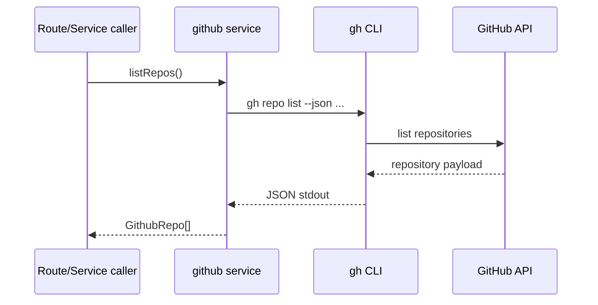

# github domain

## Purpose
Read repository metadata from the GitHub CLI.

## Dependencies with other domains
- None.

## Exposed service functions

### `createGithubService().listRepos()`

```mermaid
sequenceDiagram
    participant Caller as Route/Service caller
    participant Service as github service
    participant GH as gh CLI
    participant API as GitHub API
    Caller->>Service: listRepos()
    Service->>GH: gh repo list --json ...
    GH->>API: list repositories
    API-->>GH: repository payload
    GH-->>Service: JSON stdout
    Service-->>Caller: GithubRepo[]
```
