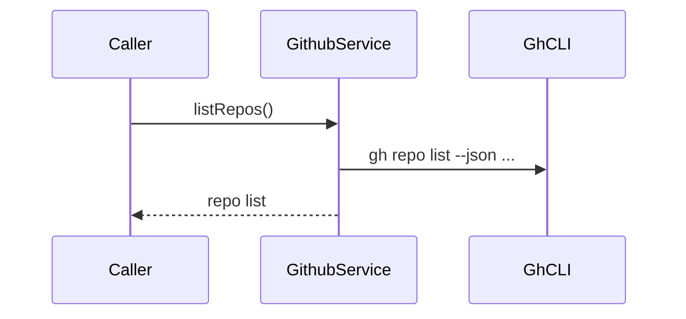
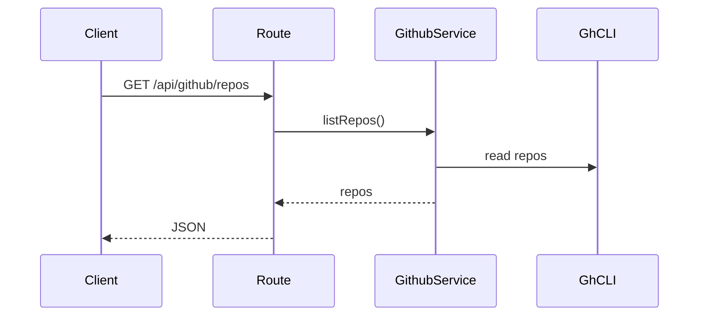

# github domain

## Purpose
Reads repository metadata from the GitHub CLI.

## Exported service functions

### `createGithubService().listRepos()`

## HTTP APIs (routes)

### `GET /api/github/repos`

