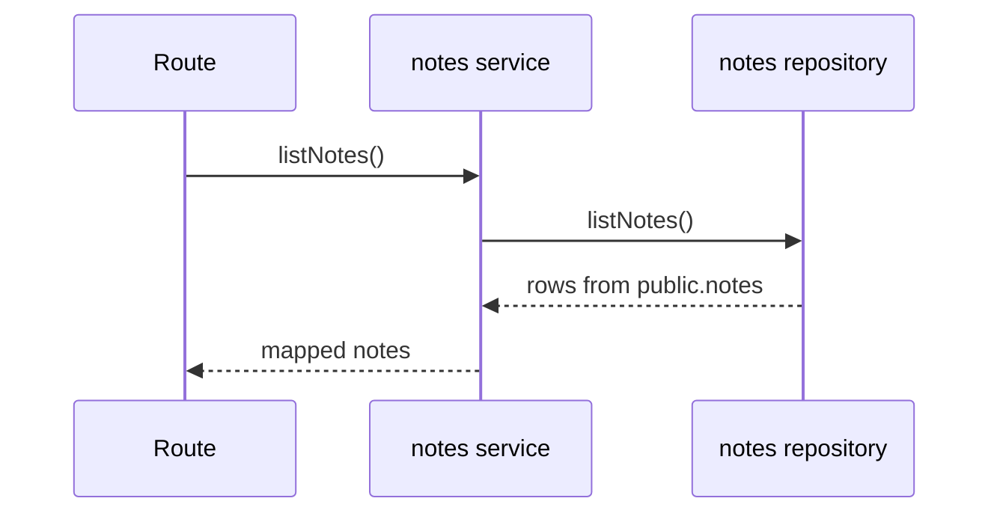

# notes domain

## Purpose
Read notes data from Supabase `public.notes` for the Notes page.

## Dependencies with other domains
- None.

## Exposed service functions

### `notesService.listNotes()`

