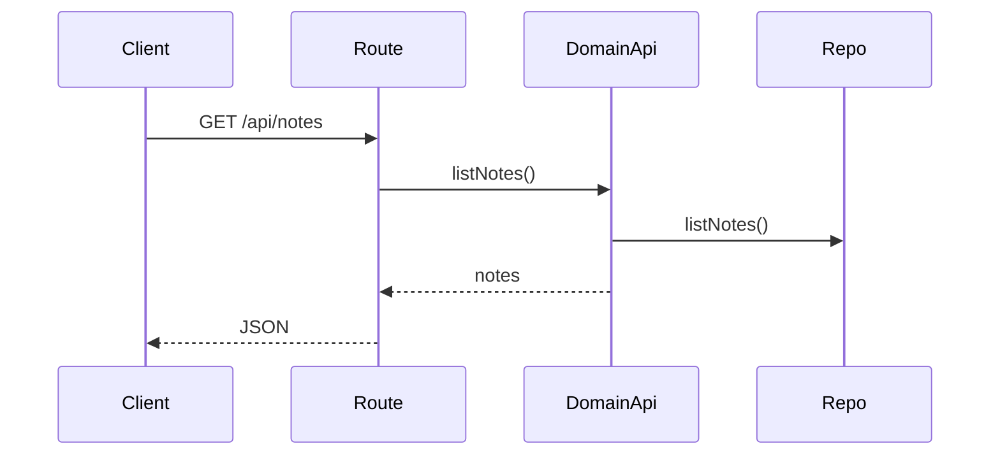

# notes domain

## Purpose
Reads notes data for the Notes page.

## Exported service functions
- None. This domain does not currently expose `service.ts`.

## HTTP APIs (routes)

### `GET /api/notes`

