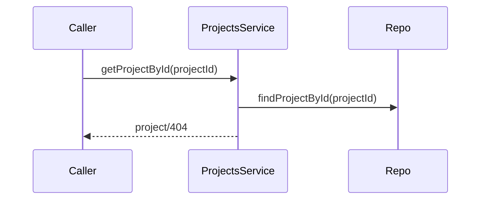
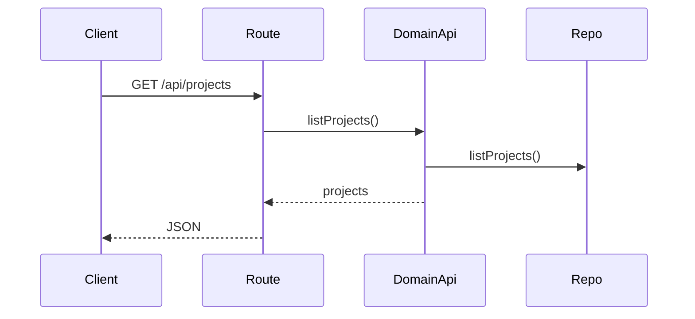
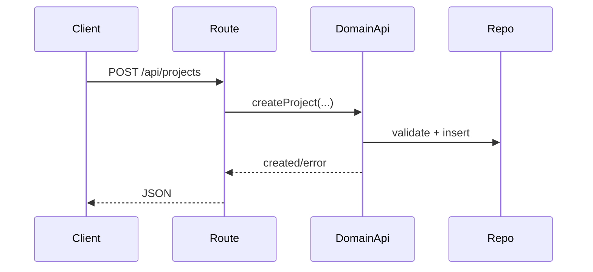
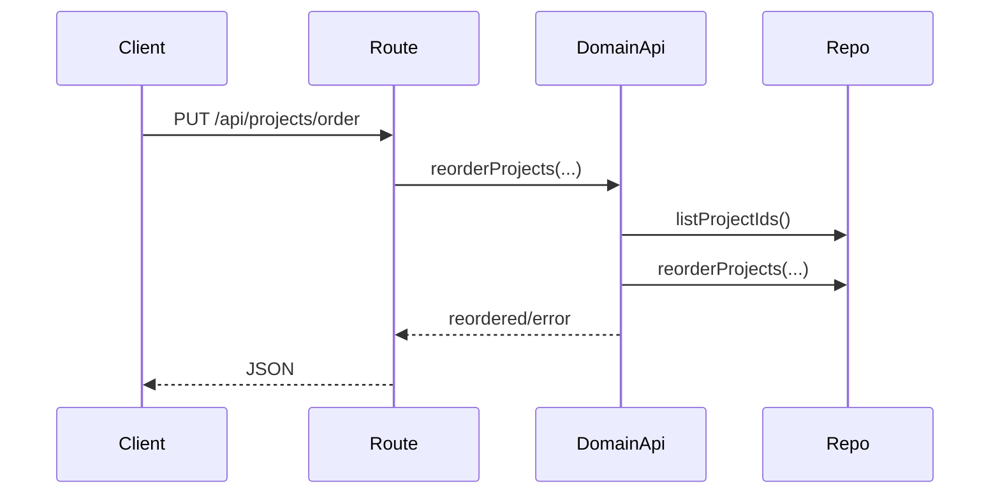
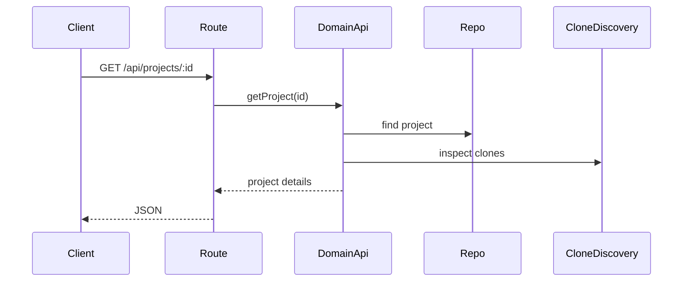
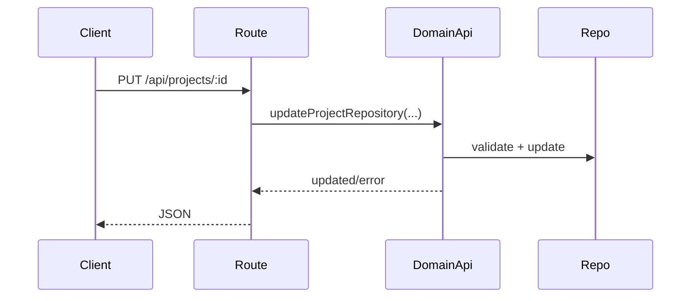
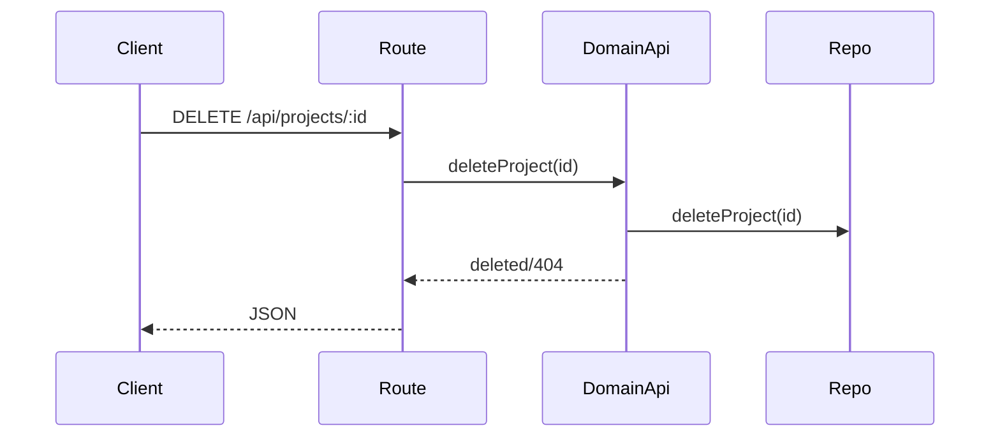

# projects domain

## Purpose
Manages projects and enriches project data with clone metadata.

## Exported service functions
### `projectsService.getProjectById(projectId)`

## HTTP APIs (routes)

### `GET /api/projects`

### `POST /api/projects`

### `PUT /api/projects/order`

### `GET /api/projects/:id`

### `PUT /api/projects/:id`

### `DELETE /api/projects/:id`

