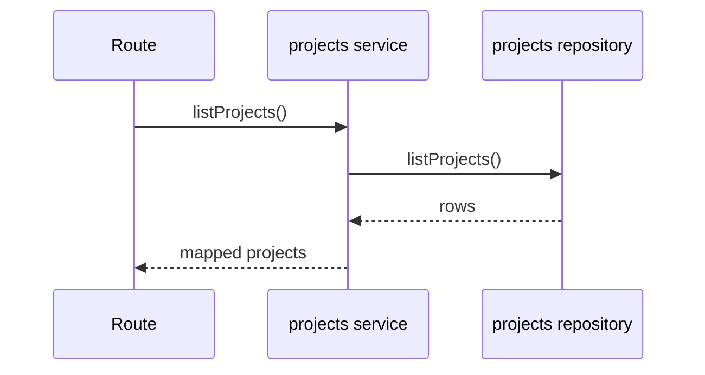
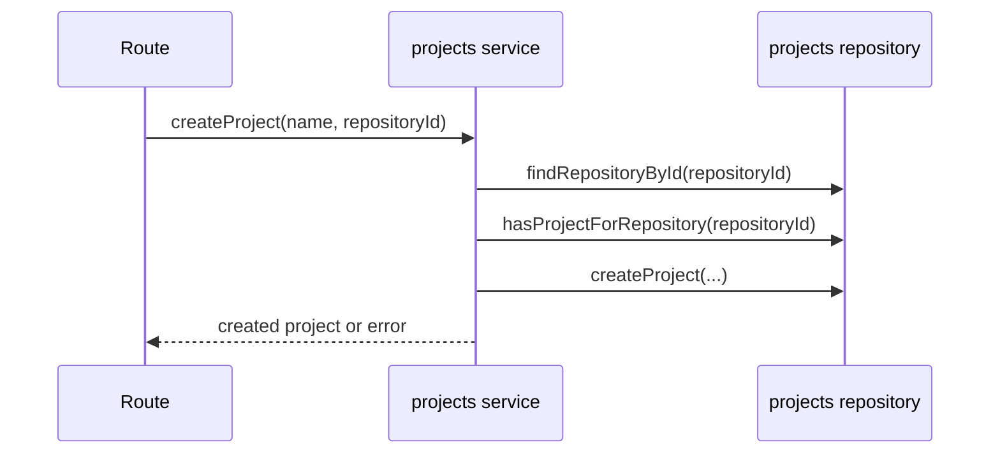
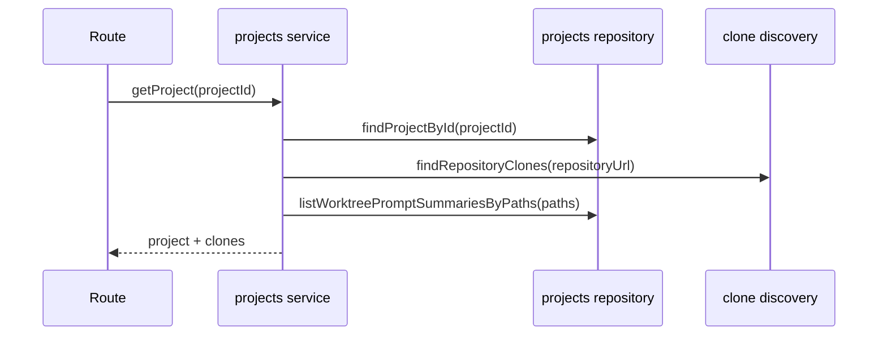
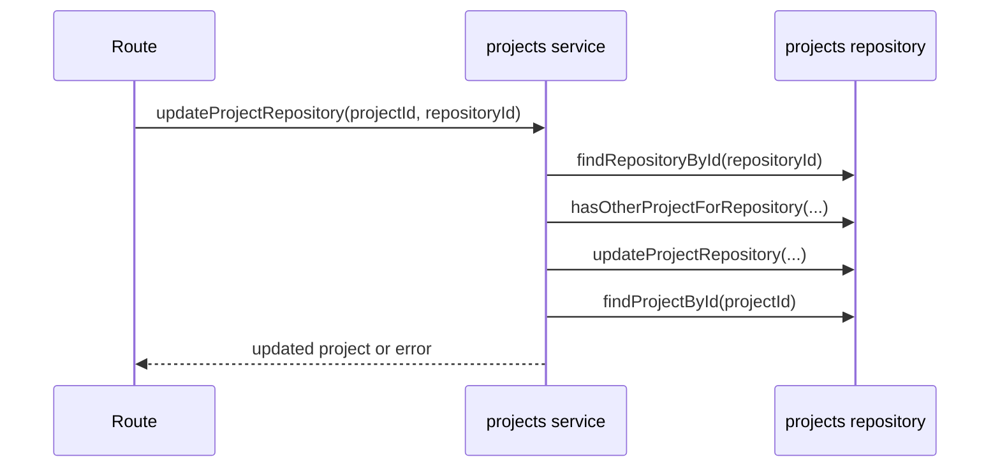
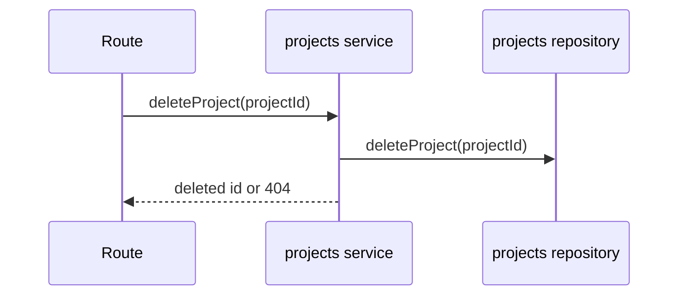

# projects domain

## Purpose
Manage projects and enrich project details with clone/worktree runtime metadata.

## Exposed service functions

### `createProjectsService({ clonesDir }).listProjects()`

### `createProjectsService({ clonesDir }).createProject(input)`

### `createProjectsService({ clonesDir }).getProject(projectId)`

### `createProjectsService({ clonesDir }).updateProjectRepository(input)`

### `createProjectsService({ clonesDir }).deleteProject(projectId)`

