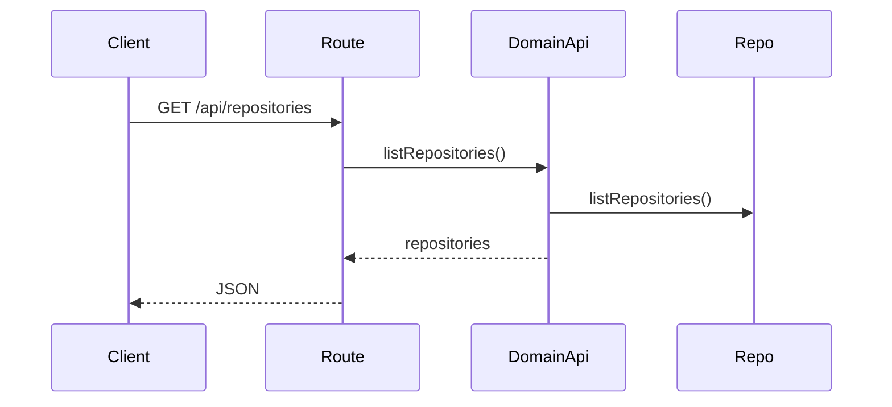
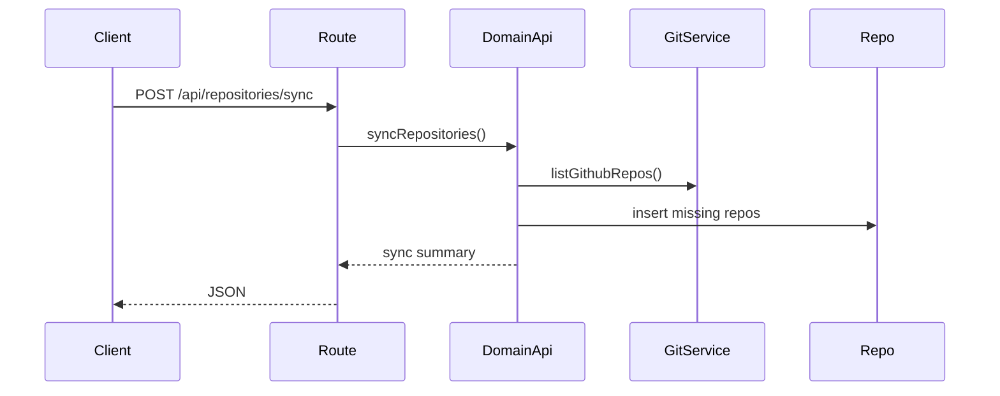

# repositories domain

## Purpose
Lists local repositories and syncs repositories from GitHub.

## Exported service functions
- None. This domain does not currently expose `service.ts`.

## HTTP APIs (routes)

### `GET /api/repositories`

### `POST /api/repositories/sync`

