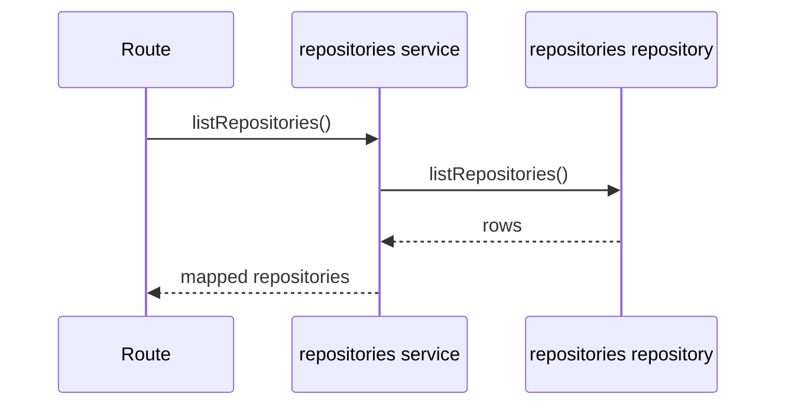
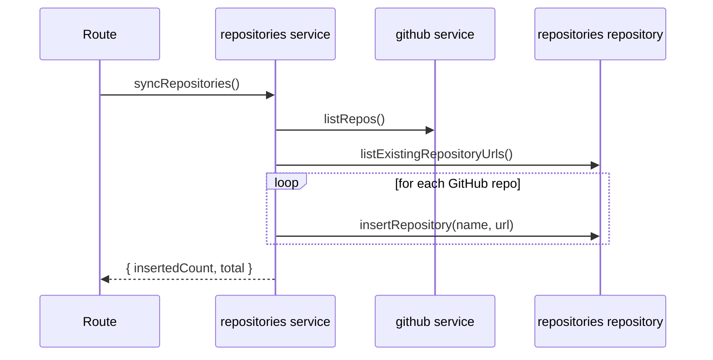

# repositories domain

## Purpose
List locally stored repositories and sync new ones from GitHub.

## Dependencies with other domains
- `github` domain via `createGithubService().listRepos`.

## Exposed service functions

### `repositoriesService.listRepositories()`

### `repositoriesService.syncRepositories()`

