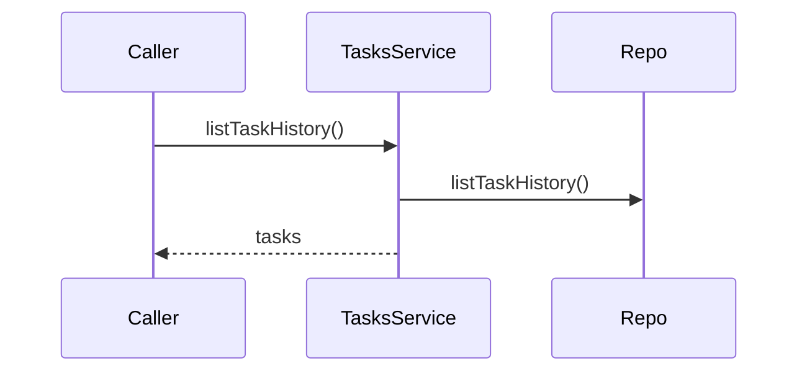
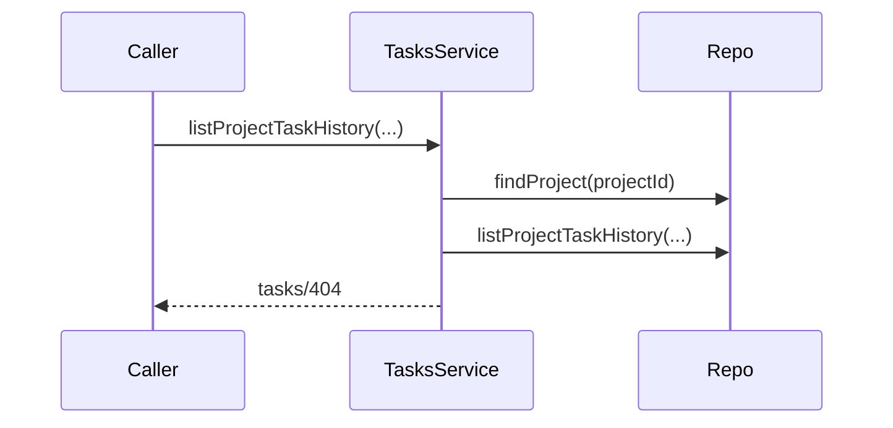
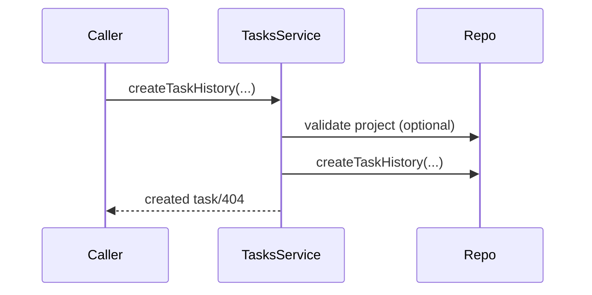
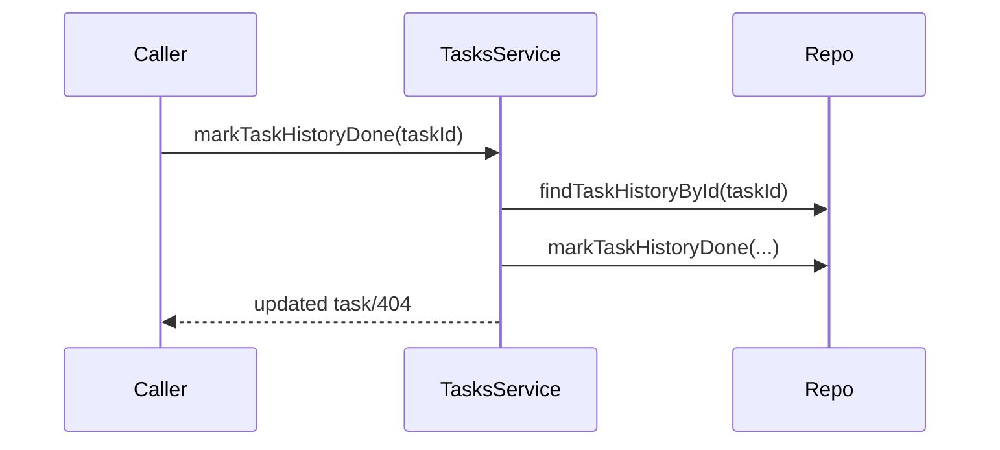
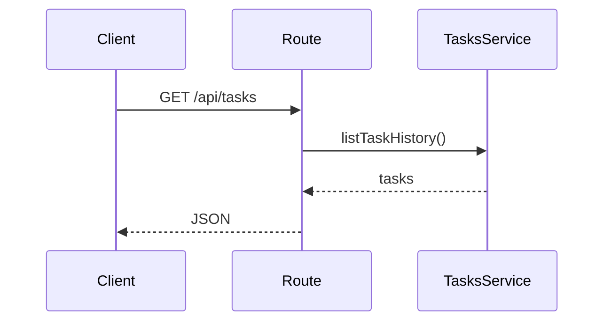
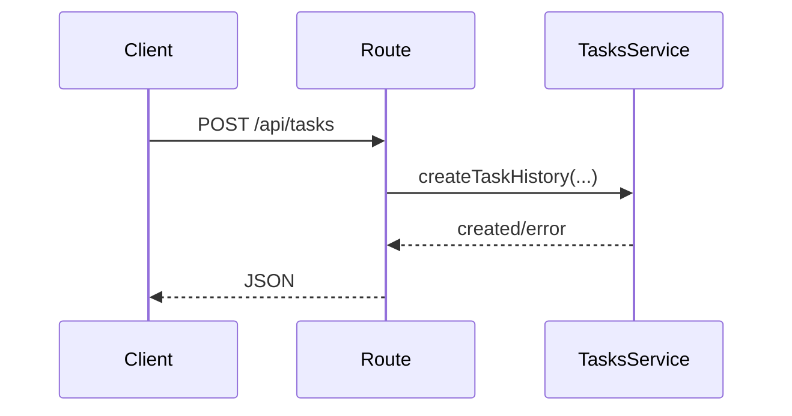
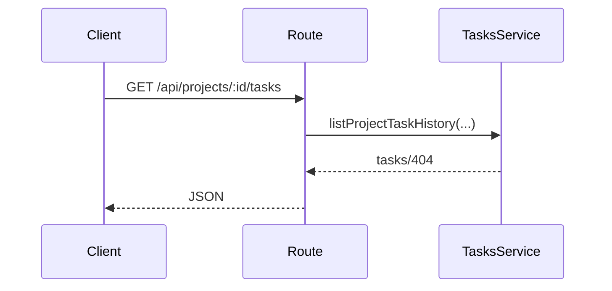
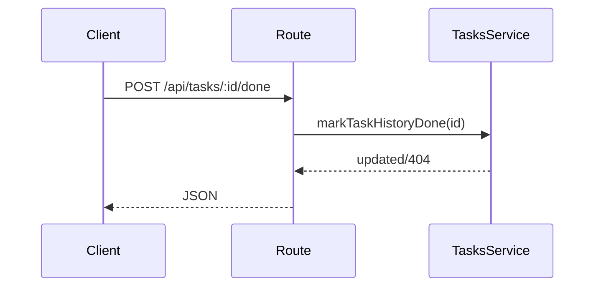

# tasks domain

## Purpose
Stores and updates task execution history.

## Exported service functions

### `tasksService.listTaskHistory()`

### `tasksService.listProjectTaskHistory(projectId, filter?)`

### `tasksService.createTaskHistory(input)`

### `tasksService.markTaskHistoryDone(taskId)`

## HTTP APIs (routes)

### `GET /api/tasks`

### `POST /api/tasks`

### `GET /api/projects/:id/tasks`

### `POST /api/tasks/:id/done`

