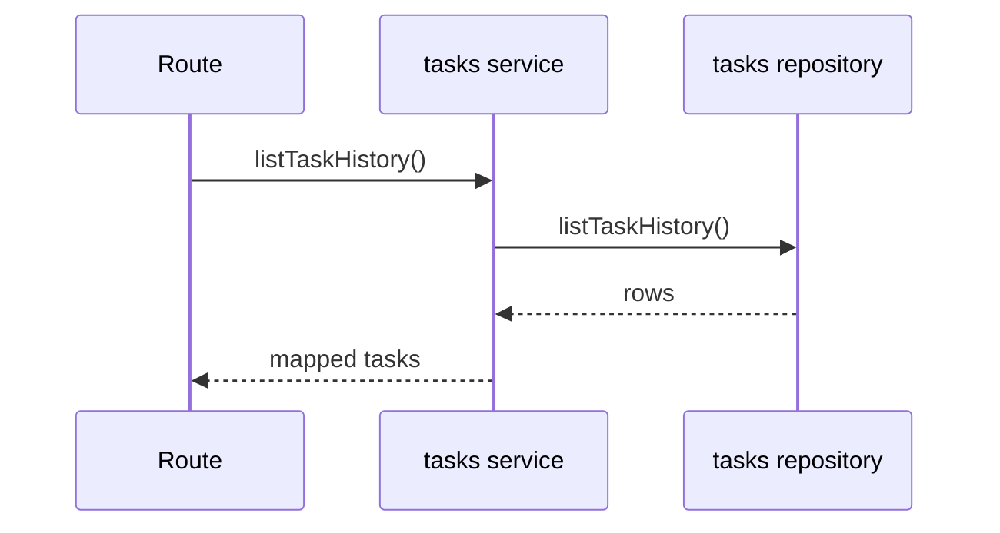
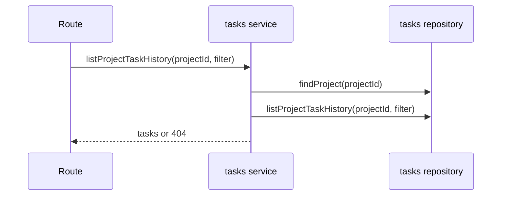
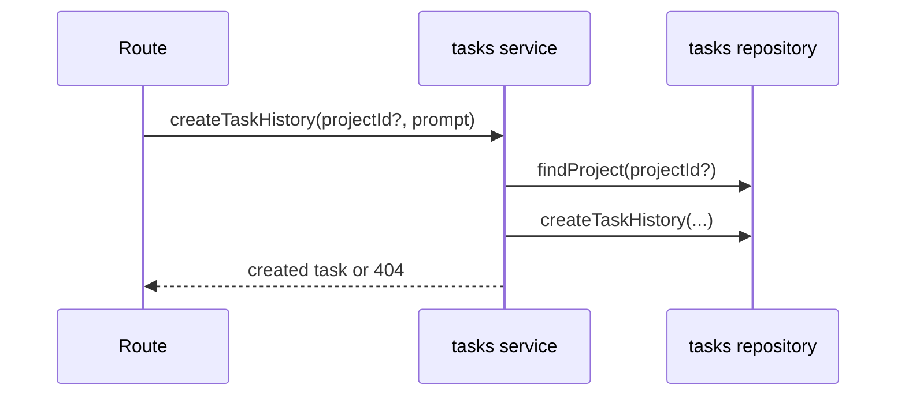
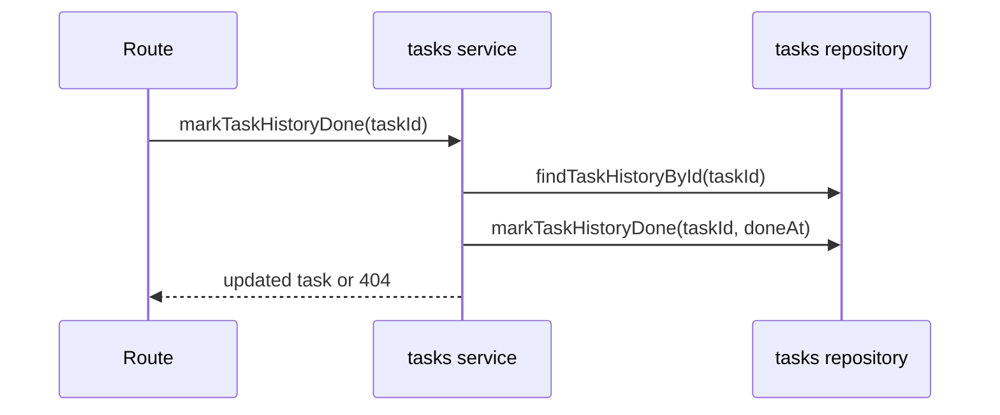

# tasks domain

## Purpose
Store and update task execution history, optionally linked to projects.

## Dependencies with other domains
- None (project existence checks happen in this domain repository).

## Exposed service functions

### `tasksService.listTaskHistory()`

### `tasksService.listProjectTaskHistory(projectId, filter?)`

### `tasksService.createTaskHistory(input)`

### `tasksService.markTaskHistoryDone(taskId)`

