# tasks domain

## Purpose
Stores and updates tasks that are pending or completed.

## Exported service functions

### `tasksService.listTasks(filter?)`
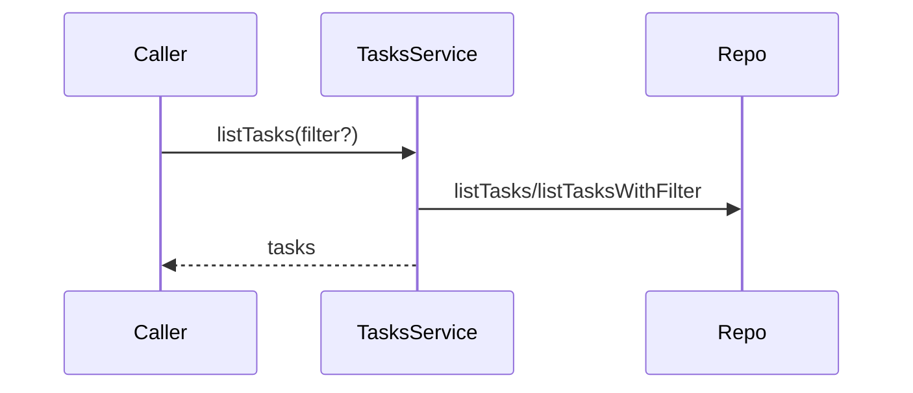

### `tasksService.listProjectTasks(projectId, filter?)`
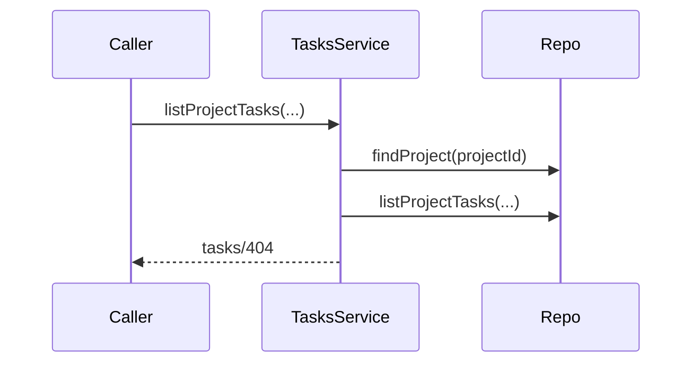

### `tasksService.createTask(input)`
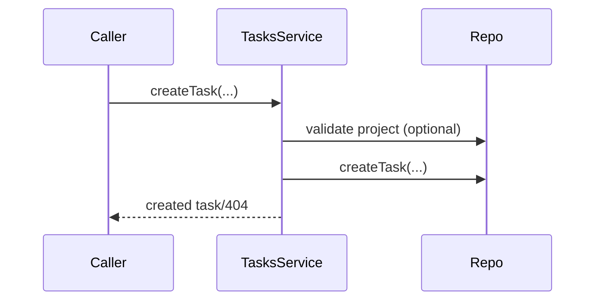

### `tasksService.getTaskById(taskId)`
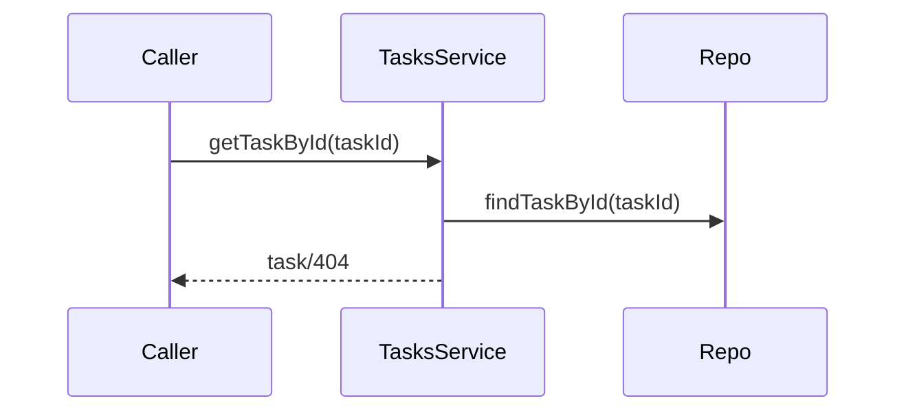

### `tasksService.markTaskDone(taskId)`
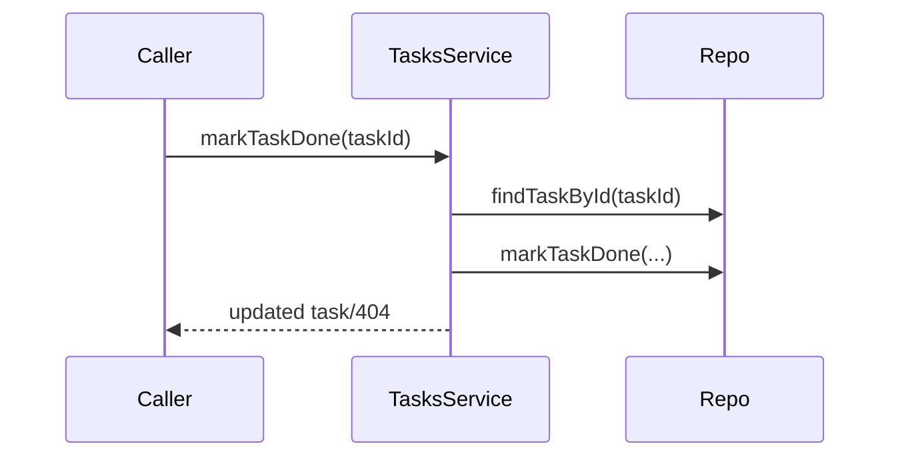

### `tasksService.deleteTask(taskId)`
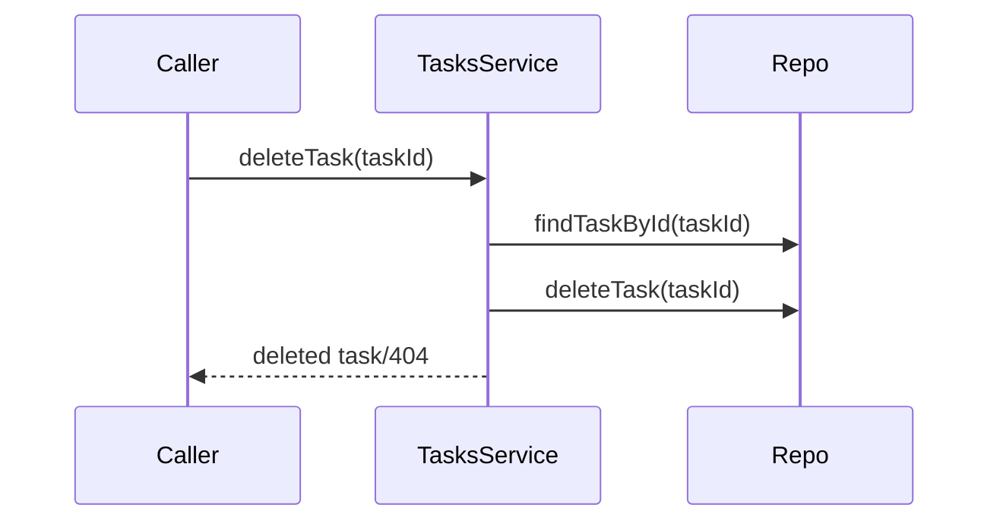

## HTTP APIs (routes)

### `GET /api/tasks`
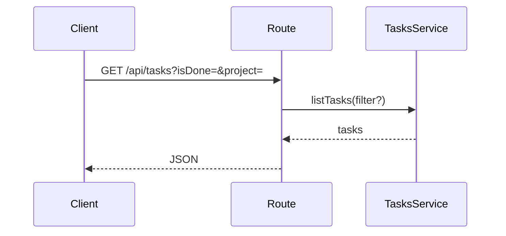

### `POST /api/tasks`
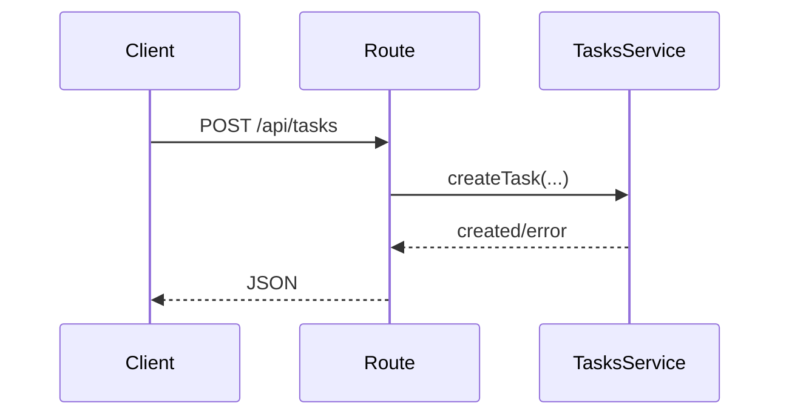

### `GET /api/projects/:id/tasks`
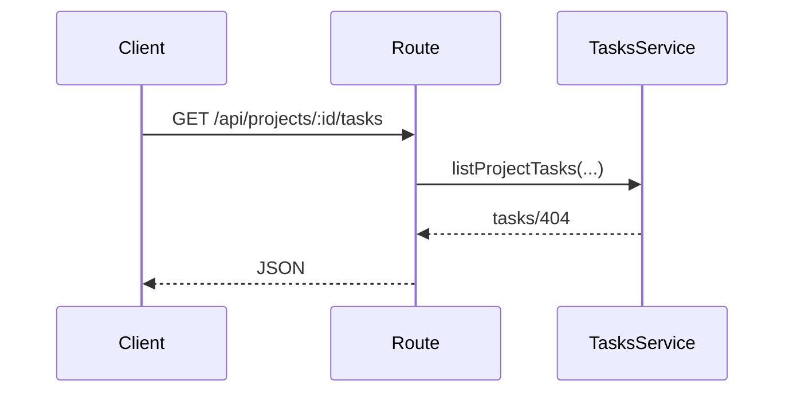

### `POST /api/tasks/:id/done`
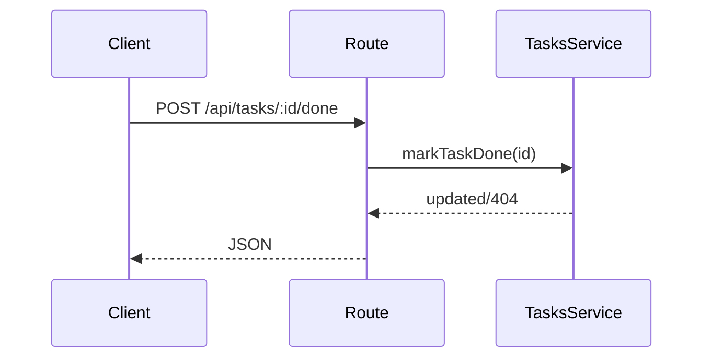

### `DELETE /api/tasks/:id`
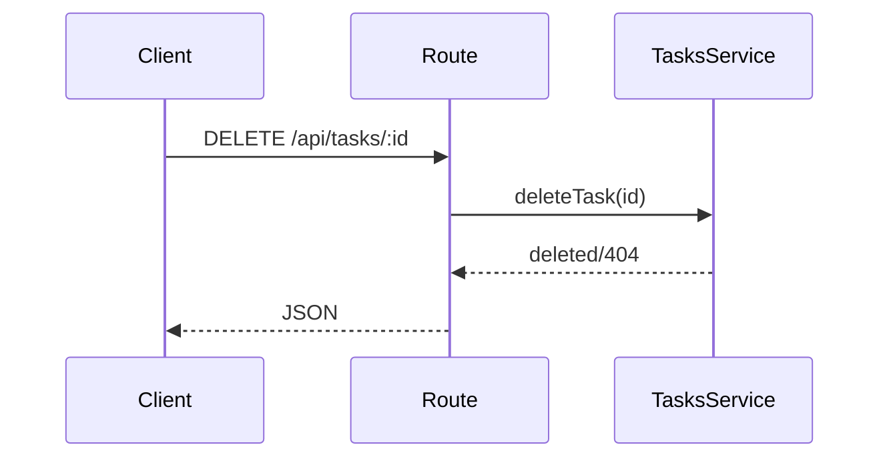
