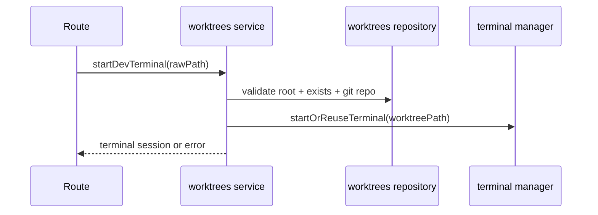
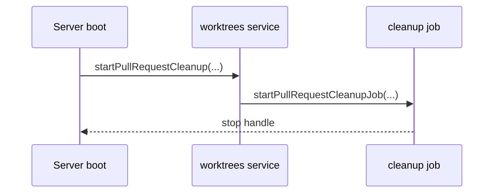

# worktrees domain

## Purpose
Start/reuse dev terminals for allowed worktree paths and run periodic PR cleanup.

## Dependencies with other domains
- None.

## Exposed service functions

### `createWorktreesService({ clonesDir }).startDevTerminal(rawPath)`

### `startPullRequestCleanup({ clonesDir, intervalMs? })`

